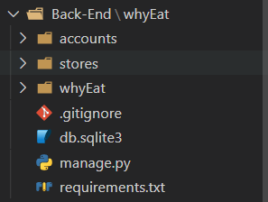
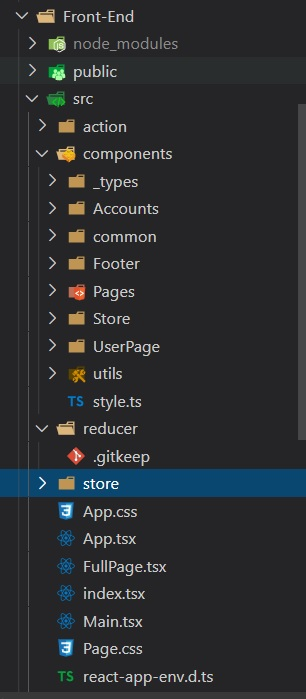
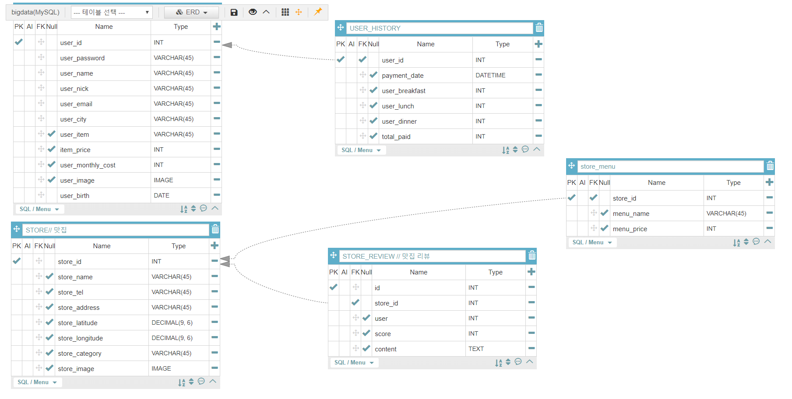

# A105조 - 프로젝트 맛돈


## 0. 목표

카드사와 음식점 빅데이터를 활용한 소비 분석 및 음식점 추천 서비스를 만들어보자


## 1. 기술스택
- Main: React, TypeScript, Styled-Components, MySQL, Django, Redux
- Module: Axios
- Infra: AWS

## 2. 역할 분담

* 노영지 (팀장) - 총괄, 프론트엔드
* 김은수 - Git branch, 프론트엔드
* 정병학 - JIRA, 서버
* 박민기 - Sqeuence Diagram, DB
* 홍수경 - Wiki, 크롤링, 프론트엔드


## 3. 개발 과정 (목차)
1. [아이디어 기획 및 사전 준비](#아이디어-기획-및-사전-준비)
2. [Git Branch 환경 설정 및 와이어프레임 작업](#Git-Branch-환경-설정-및-와이어프레임-작업)
3. [서버 배포 및 폴더구조 설계 및 크롤링](#서버-배포-및-폴더구조-설계-및-크롤링)
4. [프론트 레이아웃 및 DB 모델링](#프론트-레이아웃-및-DB-모델링)
5. [카카오 로그인](#카카오-로그인)
6. [백엔드 API 구성 및 구현](#백엔드-API-구성-및-구현)
7. [협업 필터링 알고리즘](#협업-필터링-알고리즘)

   


### `01`
### 아이디어 기획 및 사전 준비
- [아이디어회의.pdf 바로가기](https://lab.ssafy.com/s02-bigdata-sub2/s02p22a105/blob/develop/idea.pdf)
- React, TypeScript, Django, MariaDB, Pandas 학습


### `02`
### Git Branch 환경 설정 및 와이어프레임 작업
#### 01. Git Branch 전략
Git Flow방식을 사용하여 브랜치를 관리한다.

1. master : 배포 버전 소스(release브랜치를 통해서만 merge)
2. develop : 개발 완료된 소스(master브랜치에서 분리)
3. feature/{기능} : 새로운 기능 개발(develop에서 분리되며 완료 시 develop에 PR)
4. release : 배포 전 브랜치(develop에서 분리)

- 개발 진행 시 develop에서 브랜치를 분리하여 기능작업 후 develop에 병합을 수행한다.
- 배포 전 Test를 위해 release브랜치를 분리하며 Bug에 대하여 release에서 수정 후 master, develop브랜치 2군데에 병합한다.

#### 02. 와이어프레임 (Adobe XD)
###### 비회원

- 메인페이지 - 노영지 

- 정보입력페이지 - 노영지 
- 식비 입력페이지 - 노영지 

- 결과페이지 - 박민기
- 맛집을 추천해주겠다는 페이지 - 정병학
- 맛집결과페이지 ( 돈을 아낄 수 있는 페이지, 돈을 안아끼는 페이지 ) - 정병학


###### 회원

- 식비입력페이지-  노영지 
- 회원가입 - 노영지
- 로그인 - 노영지
- 결과페이지 - 박민기
- 물품관련 결과페이지 ( 타인의 위시리스트 보러가기 ) - 박민기
- 다른사람들의 위시리스트 - 김은수
- 맛집 ( 돈을 아낄 수 있는  페이지, 돈을 안아끼는 페이지) - 정병학
- 마이페이지 ( 회원정보 수정 , 아이템 등록, 히스토리 페이지  ) - 홍수경
- 랭킹, 버튼, navbar - 김은수

###### 결과
https://xd.adobe.com/view/ef724d15-3efd-4dcb-a922-20f8ffb21207-ba21/?fullscreen


### `03`
### 서버 배포 및 폴더구조 설계 및 크롤링
#### 01. 서버 배포
1. 인스턴스 생성 후 .pem 파일을 다운받는다

   - pem 파일을 통해 서버에 접속 가능하게 해준다.

     `ssh - i <pem 파일 경로 써주고> <host 주소 써준다>`

2. ubuntu 서버에 접속 후 django 프로젝트를 git에 설치 해준다.

3. 프로젝트 접속 후 pyenv( 가상환경 설정 해준다 )

4. requirements.txt 에 있는 것들을 설치해준다. 

###### mysql 설치

1. `sudo apt-get install mysql-server-5.7`

   - 여기서 sudo는 super do의 약자

2. `sudo vim /etc/mysql/my.cnf` 에서 한글이 깨지지 않도록 설정해준다.

   - vim 에서 insert 모드로 하려면 i 키를 눌러 insert 모드로 입력가능하다.

   - 입력이 끝나면 esc를 누르고 :wq 를 입력해주면 쓰고 나가기이다.

     ```
     [client]
     
     default-character-set=utf8mb4
     
     [mysql]
     
     default-character-set=utf8mb4
     
     [mysqld]
     
     collation-server = utf8mb4_unicode_ci
     
     init-connect='SET NAMES utf8mb4'
     
     character-set-server = utf8mb4
     
     입력해줘야 할 코드 
     ```

3. 기본 설정을 끝내고 mysql 접속할 때에는 `sudo -u root -p`이후 비밀번호 입력하고 접속

   - mysql 창 안에서 db 수정을 하고 항상 `flush privileges` 를 입력해줘야 반영된다.

4. django의 settings.py에서 DATABASES 부분을 수정해줘야한다. 

   ```django
   DATABASES = {
   
       'default': {
   
   #'ENGINE': 'django.db.backends.sqlite3',
   
   #'NAME': os.path.join(BASE_DIR, 'db.sqlite3'),
   
   'ENGINE': 'django.db.backends.mysql',
   
   'NAME': 'my_db', # DB명
   
   'USER': 'root', # 데이터베이스 계정
   
   'PASSWORD': 'pw1234', # 계정 비밀번호
   
   'HOST': 'localhost', # 데이테베이스 주소(IP)
   
   'PORT': '3306', # 데이터베이스 포트(보통은 3306)
   
   'OPTIONS': {
   
   'init_command': 'SET sql_mode="STRICT_TRANS_TABLES"'
   
   }
   
       }
   
   }
   ```

###### aws 배포 관련 용어 정리

- ubuntu : 서버의 OS

- Nginx : 웹서버, 클라이언트로부터의 http 요청을 받아 정적인 페이지 / 파일을 돌려줌

- uWSGI : 웹 서버(Nginx) 와 웹 에플리케이션 (django) 간의 연결을 중계해줌

  이걸 사용하면 ubuntu 서버에서 `python manage.py runserver` 필요 없이

  서버 가동 가능하고 포트번호를 따로 입력해주지 않아도 된다.

- WSGI  ( Web Server Gateway Interface )

  : 파이썬에서 웹 서버와 웹 에플리케이션간의 동작을 중계해주는 인터페이스 

###### 폴더구조 설계
- 리액트 프로젝트 폴더구조 참고자료: https://speakerdeck.com/soyoung210/heonjibjulge-saejibdao-riaegteu-peurojegteu-gujojojeong

- 현재 폴더구조 (20.04.10)



###### 크롤링
###### BeautifulSoup4 사용해서 웹 크롤링 + CSV 로 만들기

- 사용할 모듈 설치 

```bash
pip install beautifulsoup4
pip install requests
```

* beuatifulsoup4

html 에서 쉽게 파싱할 수 있도록 도와주는 모듈

*  requests

html 에서 요청을 사용하기 위한 모듈

-  코드 내용 정리 

[https://sooya14.tistory.com/entry/Python-%EC%9B%B9-%ED%81%AC%EB%A1%A4%EB%A7%81]


### `04`
### 프론트 레이아웃 및 DB 모델링
###### 프론트 레이아웃
###### FullPage
- 사용할 모듈 설치 
```bash
npm install @fullpage/react-fullpage
```

- FullPage 사용

```javascript
import ReactFullpage from "@fullpage/react-fullpage";
```

- FullPage Options

```
scrollingSpeed: 스크롤 했을 때 내려가는 속도 조절
- navigation: 오른쪽 네이게이션바 활성화
- verticalCenterd: true일 경우 중앙정렬 (기본값 true)
```

다양한 옵션들이 있음 => https://github.com/alvarotrigo/fullPage.js/

하지만 react-fullpage에 적용하기 위해서는 navigation={true} 이런식으로 {}를 붙여줘야 함

- 에러

implicitly has an 'any' type Error 발생 =>
 tsconfig.json에 다음과 같은 코드 추가

  - ```javascript
    "noImplicitAny": false
    ```


###### DB 모델링
- DB ERD



- Django models.py 

Django에서 필요한 app은 accounts, 음식점의 정보를 닮은 stores가 있기에 두개의 app을 만들었다.


###### 01. accounts

accounts > models.py 참고
향후 user의 id를 social login만을 활용할 것이기에 user의 id를 email로 받았고 필요한 스키마들을 작성했다.

###### 02. stores

stores > models.py 참고
 현재 store의 하부 내용인 Store_menu, Store_review에 대한 foreignkey 설정이 제대로 구성되지 않아 mysql에 기존의 데이터를 import할 때 오류가 발생하고 있으며 이 부분은 수정되어야 한다.

###### 03. MYSQL 및 DJANGO 설정

- Django, Mysql 연동


다음과 같이 django 의 settings.py의 DATABASES 부분을 mysql과의 연동을 위해 바꿔준다. 이후 migrate를 통해 mysql에 table이 생성된 것을 확인하고 데이터를 넣어준다. 

한글을 import할 경우 encoding 문제로 error가 발생하기에 character-set을 설정해줘야 한다. mysql의 my.ini 파일을 수정하면 기본 설정이 바뀌지만 해당 파일을 수정할 경우 현재 컴퓨터에서 mysql을 정상적으로 실행할 수 없어 mysql 접속 시 계속해서 명령어를 입력함.

```mysql
set character_set_client = utf8mb4;
set character_set_results = utf8mb4;
set character_set_connection = utf8mb4;
set character_set_database = utf8mb4;
set character_set_server = utf8mb4;
alter table tablename default character set utf8;
```

- DATA import
  - models.py의 코드와 MySql Workbench라는 프로그램을 활용

### `05`
### 카카오 로그인
https://blog.naver.com/rkdudwl/221906303255


### `06`
### 백엔드 API 구성 및 구현

###### API 정리

- Accounts
  - 회원가입, 로그인, 로그아웃, 회원정보 입력/수정/ 조회, 히스토리, 랭킹, 다른사람 내역

- Pages
  - 정보 입력 (한달식비, 오늘식비) 결과 (남은금액, 며칠 남았는지)

- Stores
  - 카페/음식 카테고리 입력, 결과 이미지/이름, 음식점 상세정보 조회


###### Back-end flow

- whyEat/urls.py
  - urlpatterns에서 path를 'api.urls'로 접근
- api/urls.py
  - CRUD주소 URL 생성
  - views.UserView.as_view()와 같이 view 함수로 접근
- api/serializers.py
  - models에서 각 model을 불러온 후 통신을 할 수 있게 serializer 생성
- api/views.py
  - serializers에서 각 model의 serializer를 불러옴
  - rest_fromework.generics를 이용해 CRUD API 함수 생성


### `07`

### 협업 필터링 알고리즘

###### 0. 데이터 가공 

* 리뷰가 존재하는 서울의 음식점을 기준으로 데이터 가공 
* 위 데이터를 기반으로 가격 데이터가 존재하는 음식점 선별 
  *  음식점의 메뉴 중 최상단의 데이터(가격)으로 선정 (단, 0원일 경우 그 다음 데이터로 선정)


###### 1. item-based CF

- 기존의 DATA를 기반으로 새로운 DATA FRAME을 만든다
  - 'USER', 'STORE_NAME', 'SCORE', 'CATEGORY_NUM' 으로 분류
  - category_num 은 임의로 비슷한 문자열을 포함한 음식점 끼리 묶어줌
- DATAFRAME으로 PIVOT_TABLE을 만들어줌
- 일단은 index 를 store로 함( 추후, user로 변경예정 )
- pivot_table의 nan값은 0으로 채워준다.
  - `final_df = final_df[final_df.category_num != 0]`
  - 아이템간 유사도는 cosine_similarity를 이용하여 구해줌.
  - scikit-learn을 이용함
  - 정리한것을 df로 다시 추출
