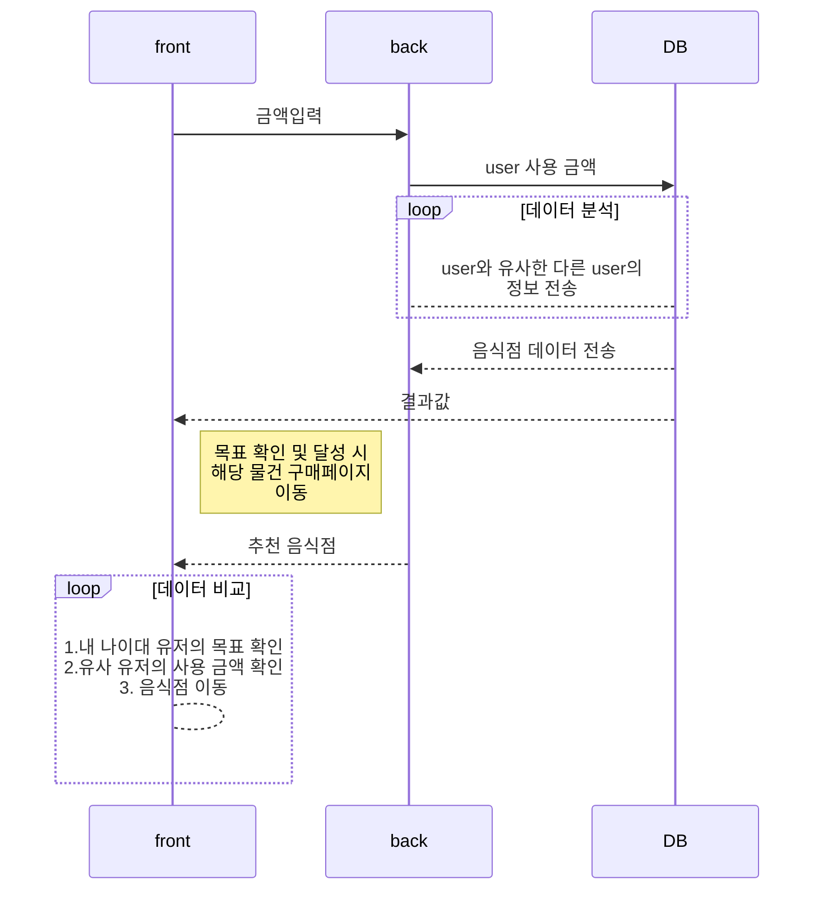

```mermaid
sequenceDiagram
	participant front
	participant back
	participant DB
	front ->> back : 금액입력
	back ->> DB : user 사용 금액
	loop 데이터 분석
        DB-->back: user와 유사한 다른 user의 <br/> 정보 전송
    end
    DB -->> back : 음식점 데이터 전송
    DB -->> front : 결과값
    Note right of front: 목표 확인 및 달성 시 <br/>해당 물건 구매페이지<br/>이동
    back -->> front : 추천 음식점
	loop 데이터 비교
		front --> front:1.내 나이대 유저의 목표 확인<br/>2.유사 유저의 사용 금액 확인<br/>3. 음식점 이동 
        end

```

